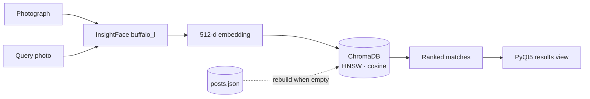

# Missing Persons Finder

Face-recognition admin panel for registering missing-person reports and
matching new photographs against them using vector similarity search.

Built with **InsightFace** embeddings, **ChromaDB** vector search, and a
**PyQt5** desktop interface.

## Overview

Searching a missing-persons registry by name fails exactly when it matters
most — when the person is found but cannot identify themselves. This tool
searches by face instead.

Every registered post is reduced to a 512-dimensional face embedding and
stored in a persistent vector index. Matching a new photo becomes a nearest-
neighbour lookup that stays fast as the registry grows, rather than a linear
scan over every stored image.

## Key features

**Face embedding extraction**
- InsightFace `buffalo_l` model
- Automatic CUDA execution with transparent CPU fallback
- 512-dimensional embedding per detected face
- Model loaded once behind a thread lock and reused

**Vector search with ChromaDB**
- Persistent client, so the index survives restarts
- HNSW indexing with cosine distance
- Add, delete, and similarity-search operations
- Rebuilds itself automatically from `posts.json` when the collection is empty

**Admin dashboard (PyQt5)**
- Post feed with auto-refresh
- Add-post form with multi-image upload
- Search view and dedicated results view
- Full-size image viewer

## Architecture



`posts.json` is the source of truth for post metadata; ChromaDB is a
derived index that can always be rebuilt from it.

## Project structure

```text
main.py              Application entry point and window wiring
config.py            Paths, thresholds, and runtime settings
face_model.py        InsightFace loading and embedding extraction
chroma_manager.py    Vector store lifecycle, query, and rebuild
utils.py             Post persistence and cosine similarity
ui/
  feed_widget.py           Post feed with auto-refresh
  add_post_widget.py       New-post form and image upload
  search_widget.py         Search input and controls
  search_results_widget.py Ranked match display
  image_viewer.py          Full-size image viewer
```

## Configuration

Defaults live in `config.py`:

| Setting | Default | Meaning |
|---|---:|---|
| `SIMILARITY_THRESHOLD` | 0.20 | Minimum cosine similarity to report a match |
| `OUTLIER_HIGH_THRESHOLD` | 0.85 | Upper bound used in outlier checks |
| `OUTLIER_LOW_THRESHOLD` | 0.25 | Lower bound used in outlier checks |
| `MAX_IMAGES` | 5 | Images allowed per post |
| `AUTO_REFRESH_MS` | 3000 | Feed refresh interval |

Post images are written to `posts/` and metadata to `posts.json`, both
resolved relative to the application directory. The same resolution works
when the app is frozen into a standalone executable.

## Installation

```bash
pip install -r requirements.txt
```

For GPU inference, replace `onnxruntime` with `onnxruntime-gpu` and install a
matching CUDA runtime. The application falls back to CPU automatically if the
CUDA provider cannot be initialised, so a GPU is optional.

## Usage

```bash
python main.py
```

InsightFace downloads the `buffalo_l` model weights on first run.

## Limitations

- Similarity thresholds are fixed constants, not calibrated against a
  labelled evaluation set — treat ranked results as candidates for human
  review, never as identification.
- Recognition accuracy degrades with pose, occlusion, low resolution, and
  large age gaps between the registered and query photographs.
- The admin panel has no authentication layer; it assumes a trusted operator
  on a trusted machine.
- All data is stored locally in plain files. Deploying this against real
  missing-persons data would require access control, encryption at rest, and
  a retention policy.

## License

[MIT](LICENSE)
